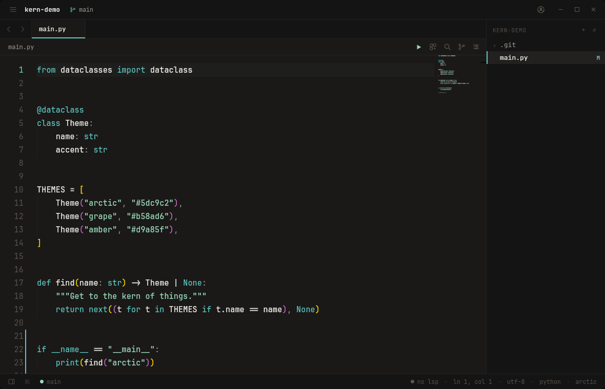
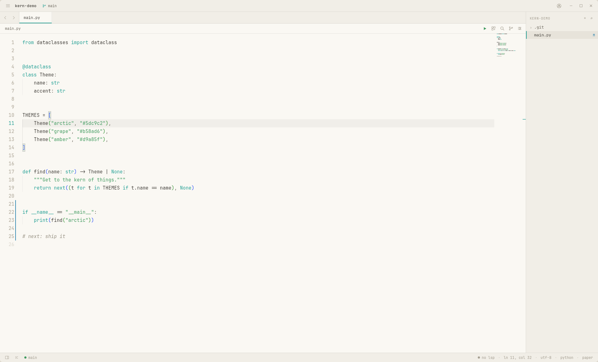
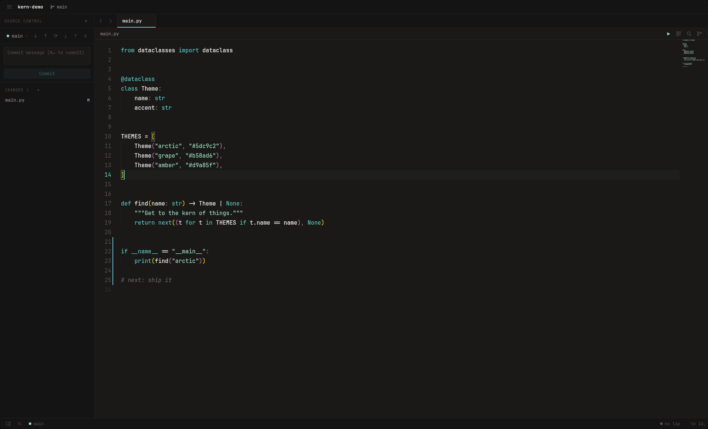
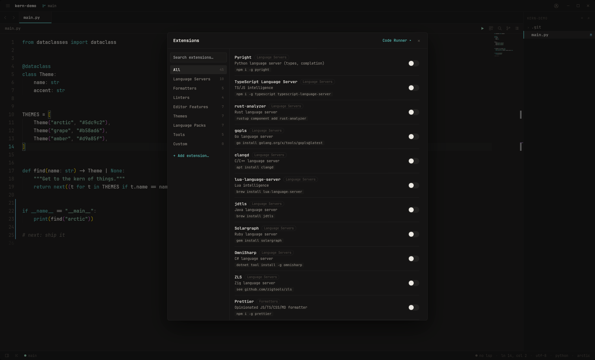
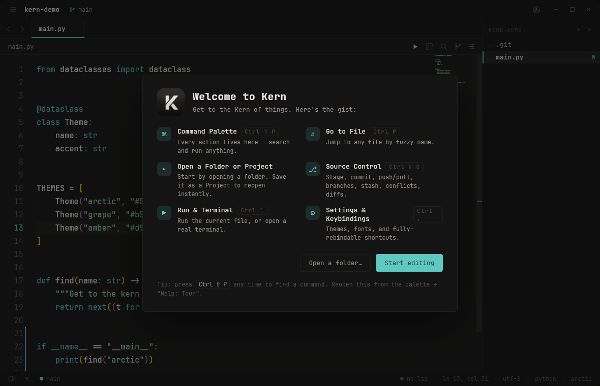

# Kern

**Get to the Kern of things.** — a calm, complete desktop code editor in the
spirit of Zed, but quieter. Warm-graphite (or light) canvas, all-monospace
chrome, and a single accent used sparingly.

Built with **Tauri 2** (Rust) + **React 19 / TypeScript / Vite** + **Monaco**.



<table>
  <tr>
    <td width="50%"></td>
    <td width="50%"></td>
  </tr>
  <tr>
    <td width="50%"></td>
    <td width="50%"></td>
  </tr>
</table>

> First launch greets you with a short tour of the key shortcuts — reopen it
> anytime from the palette → **Help: Tour**.

## Features

- **Zed-style chrome** — integrated title bar with custom window controls, nav
  arrows, a file-path breadcrumb, a **minimap**, and the file tree docked right.
- **9 themes** incl. 2 light (Paper, Frost) — applied to **both** the CSS chrome
  and Monaco, switchable instantly. Custom font, size, line-height, tab size.
- **Projects + Welcome** — save a folder as a named project, reopen instantly
  from `⌘⇧P`. Tabs + session persist across restarts.
- **LSP** — completion, diagnostics, hover, **go-to-definition**, find references,
  **rename**, format, go-to-symbol (Pyright, tsserver, rust-analyzer, gopls, clangd
  when on `PATH`).
- **Git** (`⌘⇧G`) — stage/commit/push/pull/fetch, branch switch/create/merge,
  **stash**, **conflict resolution**, side-by-side diff, blame, history, gutter
  markers.
- **Code Runner** — configurable per-language run commands + streamed output.
- **Integrated terminal** (real PTY), **split editor panes**, global
  **search & replace**, **snippets**, markdown preview, vim mode.
- **Settings + Keybindings editor** (`⌘,`) — fully rebindable, persisted;
  export/import config. Auto-save, format-on-save, problems panel.
- **Extensions page** (`⌘⇧X`), **multi-window** (`⌘⇧N`), Zen mode,
  reduced-motion aware.

## Install

Grab a package from the [latest release](https://github.com/AlexanderGese/Kern/releases/latest):

```bash
sudo dpkg -i Kern_*_amd64.deb      # Debian/Ubuntu
sudo rpm  -i Kern-*.x86_64.rpm     # Fedora/RHEL
# or: chmod +x kern-linux-x86_64 && ./kern-linux-x86_64
```

**Build & install from source** (registers it as a desktop app with an icon):

```bash
git clone https://github.com/AlexanderGese/Kern && cd Kern
bash scripts/install.sh
```

> ⚠️ **Do not `cargo install kern-code`.** Kern is a Tauri *desktop app*; crates.io
> can only carry the Rust backend, **not** the bundled web frontend — so that
> binary builds but renders a **black window**. Use the release packages or
> `scripts/install.sh` above. (The `kern-code` crate exists for source reference
> only.)

## Develop

```bash
pnpm install
pnpm tauri dev      # launches the desktop app with HMR
```

## Build

```bash
pnpm tauri build              # produces a native bundle
pnpm tauri build --debug --no-bundle   # fast standalone debug binary
```

> **Note (Linux/WebKitGTK):** `pnpm tauri dev` can occasionally render a blank
> window on first load — a WebKitGTK bug under Vite's native-ESM dev server
> (`internallyFailedLoadTimerFired`). Just reload/relaunch, or run a built binary
> (`pnpm tauri build --debug --no-bundle` → `src-tauri/target/debug/kern`), which
> serves a single bundle and is unaffected.

## Keyboard shortcuts

| Action            | Shortcut          |
| ----------------- | ----------------- |
| Save              | ⌘/Ctrl S          |
| Command palette   | ⌘/Ctrl ⇧ P        |
| Go to file        | ⌘/Ctrl P          |
| Toggle sidebar    | ⌘/Ctrl B          |
| Close tab         | ⌘/Ctrl W          |
| Next / prev tab   | ⌘/Ctrl ⌥ → / ←    |
| Source control    | ⌘/Ctrl ⇧ G        |
| Addons            | ⌘/Ctrl ⇧ X        |
| About & settings  | ⌘/Ctrl ,          |
| Increase / decrease font | ⌘/Ctrl + / −  |
| Cycle theme       | ⌘/Ctrl K, then T  |

## Language servers (optional)

LSP features light up automatically when the relevant server is installed and
on `PATH`:

| Language   | Server                          |
| ---------- | ------------------------------- |
| Python     | `pyright-langserver` (or `basedpyright-langserver`) |
| TypeScript | `typescript-language-server`    |
| Rust       | `rust-analyzer`                 |
| Go         | `gopls`                         |
| C / C++    | `clangd`                        |

## Architecture

- **React UI** — layout, theming, command palette, Monaco, the LSP bridge.
- **Rust backend** — filesystem (read/write/watch), directory walking, git
  status via `git2`, and spawning language servers (bridged stdio ↔ WebSocket).
- Frontend ↔ Rust over Tauri IPC (`invoke` commands + `emit` events).

See `CODE_EDITOR_SPEC.md` for the full design system and build spec.

## Notes

- Settings persist on disk via `tauri-plugin-store` (not `localStorage`).
- Fonts: JetBrains Mono (SIL OFL), bundled under `public/fonts`.
